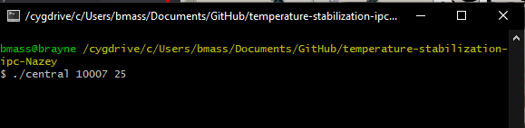

## Temperature Stabilization - Brian Massino

Compiled with:  

gcc -o central central.c && gcc -o external external.c

The point of this program is to illustrate the use of a server and multiple clients

The user first starts up the server with a portnumber and initial central temperature. Then, each client starts with a temperature and a client number/connection number.

On the first run, the system sends out a request for new temperatures. If the system does not get the same exact temperatures from last time, the system generates a new central temperature based on the current values that the external processes just sent to the server. Continues until it converges.

First, one must start the server on its own like such:

./central portnumber temperature

Then, we must start our 4 clients.

Using ./external hostname port temperature connectionnumber

Then, as you connect the clients, the server will provide feedback on what those specific clients sent. Once all clients have been connected, the server will begin its computation and accordingly request/send new temperatures to the clients as needed, until the system has stabilized.

Here is a finished example:

After it has completed, all of the sockets are closed and each program is quit.